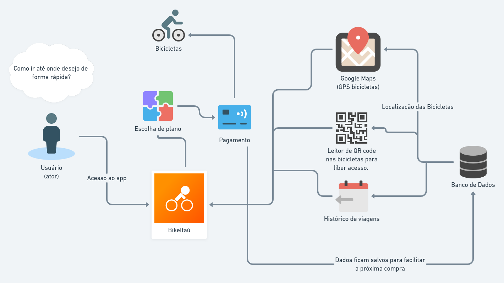

# Rich Picture

## Histórico de Revisões 

| Data | Versão | Descrição | Autor(es) |
| :----: | :----: | :----: | :----: |
| 11/03/2021 | 1.0 | Criação do documento | [Tomás veloso](https://github.com/tomasvelos0) |

## 1. Introdução

Rich Picture é um modelo informal, feito na forma de desenho, para analisar o problema central, expressar ideias, analisar autores e processos, e identificar possíveis conflitos.

#### Rich Picture

## 2. Referências
