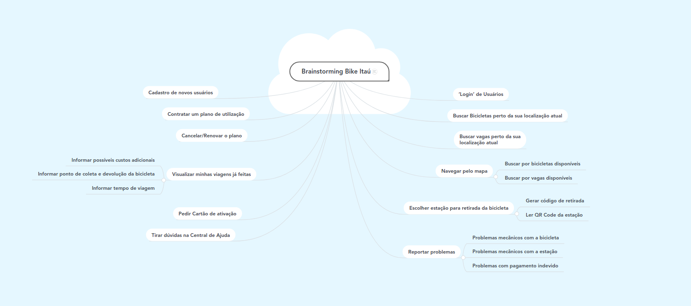

# Brainstorming 

 

A técnica de elicitação brainstorming é uma atividade desenvolvida para aproveitar a criatividade dos membros de uma equipe, propondo em uma reunião que os membros sugiram qualquer pensamento ou ideia relacionados ao tema do projeto.  

 

# Metodologia 

 

Usamos a plataforma online MindMeister. Dentro do aplicativo os membros do grupo adicionaram suas ideias de possíveis requisitos funcionais e não funcionais do Bike Itaú / tembici.  

 

## Brainstorming Bike Itaú 

 

 

# Requisitos Elicitados 

| ID | Nome |  
| :---: | --- |
| #RF01 | Cadastro de novos usuários |  
| #RF02 | Contratar um plano de utilização |  
| #RF03 | Login |  
| #RF04 | Cancelar/Renovar o plano de utilização |  
| #RF05 | Visualizar viagens já feitas | 
| #RF06 | Informar possíveis custos adicionais | 
| #RF07 | Informar pontos de coleta e devolução da bicicleta | 
| #RF08 | Informar tempo de viagem | 
| #RF09 | Pedir cartão de ativação | 
| #RF10 | Buscar bicicletas perto da localização do usuário | 
| #RF11 | Buscar vagas perto da localização do usuário | 
| #RF12 | Navegar pelo mapa | 
| #RF13 | Filtrar navegação pelo mapa entre bicicletas e vagas disponíveis | 
| #RF14 | Escolher estação para retirada da bicicleta | 
| #RF15 | Gerar código de retirada | 
| #RF16 | Ler QR-Code da estação | 
| #RF17 | Reportar problemas | 

## Referências  

- https://www.mindmeister.com/ 

## Históricos de Revisões  

| Data | Versão | Descrição | Autor(es) |  
| :---: | :---: | :---: | :---: | 
| 09/03/2021 | 0.1 | Realização do brainstorming | [Marcos Raimundo](https://www.github.com/MarcosFloresta), Tomás Veloso, Matheus Clemente |  
| 09/03/2021 | 1.0 | Criação do documento | [Marcos Raimundo](https://www.github.com/MarcosFloresta) | 