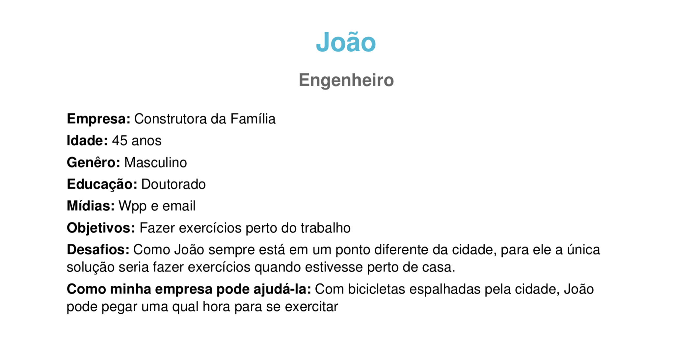
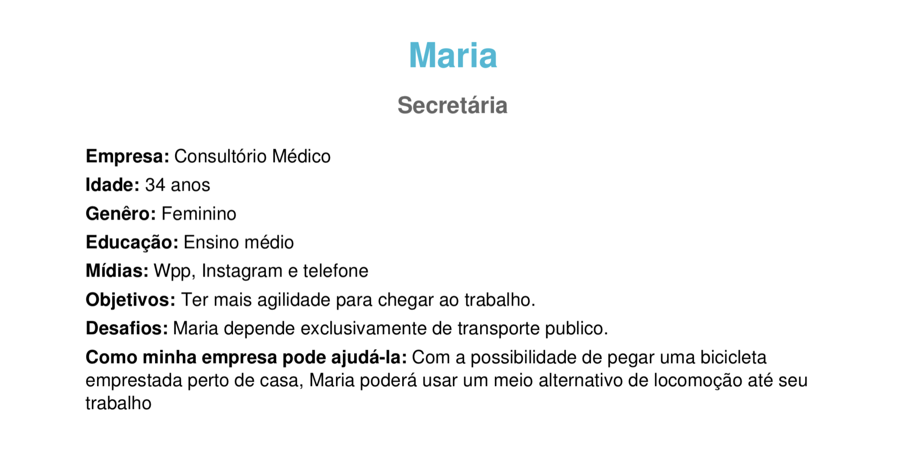
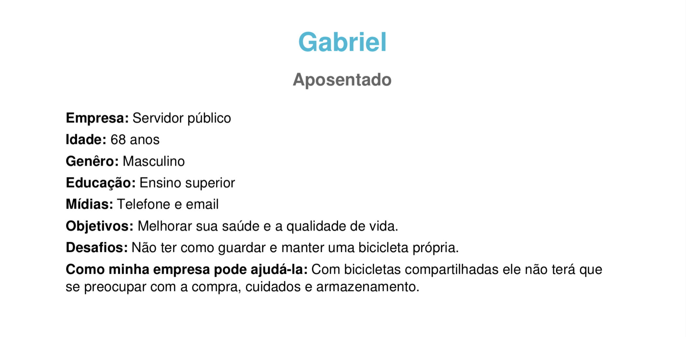
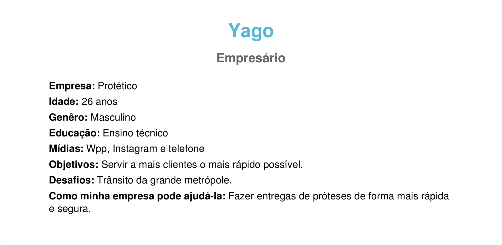

# Personas

## Introdução

O uso de personas tem o objetivo de criar personagens fictícios baseadas em possíveis usuários reais para o software/sistema,  levando em consideração comportamentos, personalidade, dificuldades, objetivos, satisfação e experiências. O objetivo do método é criar um perfil do usuário  com as  principais características do púbico alvo para que consiga criar estratégias que satisfaça a atenda o público.

## Metodologia 

Para o projeto, decidimos criar personas com objetivos e dificuldades baseadas em pessoas fictícias, usando um gerador de personas online (O Fantástico Gerador de Personas de Marketing)

## Personas

### Persona 1

### Persona 2

### Persona 3

### Persona 4

### Persona 5

### Persona 6

## Referências

- [O Fantástico Gerador de Personas de Marketing](https://geradordepersonas.com.br/)

## Histórico de Revisões

| Data | Versão | Descrição | Autor(es) |
| --- | --- | --- | --- |
| 07/03/2021 | 1.0 | Criação do documento e adição de personas | [Marcos Raimundo](https://www.github.com/MarcosFloresta/) |

