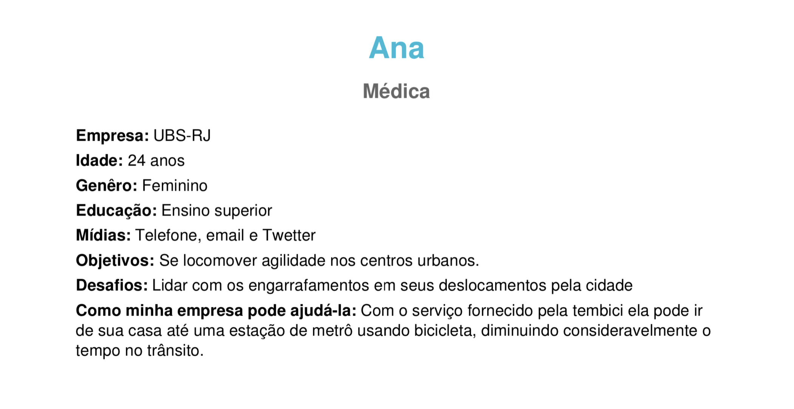

# Personas

## Introdução

O uso de personas tem o objetivo de criar personagens fictícios baseadas em possíveis usuários reais para o software/sistema,  levando em consideração comportamentos, personalidade, dificuldades, objetivos, satisfação e experiências. O objetivo do método é criar um perfil do usuário  com as  principais características do púbico alvo para que consiga criar estratégias que satisfaça a atenda o público.

 

## Metodologia 

Para o projeto, decidimos criar personas com objetivos e dificuldades baseadas em pessoas fictícias, usando um gerador de personas online (O Fantástico Gerador de Personas de Marketing).

 

## Personas

### Persona 1

<h6 align = "center">Figura 1 - Persona 1.</h6>

<h6 align = "center">Fonte: Site geradordepersonas</h6>

### Persona 2

<h6 align = "center">Figura 2 - Persona 2.</h6>

<h6 align = "center">Fonte: Site geradordepersonas</h6>

### Persona 3

<h6 align = "center">Figura 3 - Persona 3.</h6>

<h6 align = "center">Fonte: Site geradordepersonas</h6>

### Persona 4

<h6 align = "center">Figura 4 - Persona 4.</h6>

<h6 align = "center">Fonte: Site geradordepersonas</h6>

### Persona 5

<h6 align = "center">Figura 5 - Persona 5.</h6>

<h6 align = "center">Fonte: Site geradordepersonas</h6>

### Persona 6

<h6 align = "center">Figura 6 - Persona 6.</h6>

<h6 align = "center">Fonte: Site geradordepersonas</h6>

## Referências

* [O Fantástico Gerador de Personas de Marketing](https://geradordepersonas.com.br/), acessado dia 07 de Março de 2021.

## Histórico de Revisões

| Data | Versão | Descrição | Autor(es) |
| --- | --- | --- | --- |
| 07/03/2021 | 1.0 | Criação do documento e adição de personas | [Marcos Raimundo](https://www.github.com/MarcosFloresta/) |
| 18/03/2021 | 1.1 | Revisão do documento | [Tomás Veloso](https://www.github.com/tomasvelos0/) |
