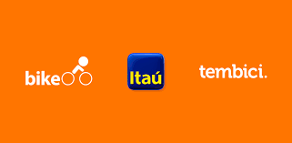

# Grupo 2 - Bike Itaú/ tembici.

  

<!--  -->

Repositório destinado ao projeto de Requisitos de Software do Grupo 2.

 

## Equipe

| Nome | Matrícula | GitHub | Email |
| --- | --- | --- | --- |
| Marcos Lima Raimundo | 180145231 | [MarcosFloresta](https://github.com/MarcosFloresta) | floresta.marcos@outlook.com |
| Matheus Clemente | 180042817 | [matheusclemente](https://github.com/matheusclemente) | matheus.klementt@gmail.com|
| Tomás Veloso | 180138596 | [tomasvelos0](https://github.com/tomasvelos0) | tomasvelozo@hotmail.com |

## Histórico de Revisões 

| Data | Versão | Descrição | Autor(es) |
| :---: | :---: | :---: | :---: |
| 16/02/2021 | 1.0 | Criação do documento README.md | [Marcos Lima](https://github.com/MarcosFloresta) |
| 22/02/2021 | 1.1 | Atualização das matrículas e emails dos integrantes | [Marcos Lima](https://github.com/MarcosFloresta) |