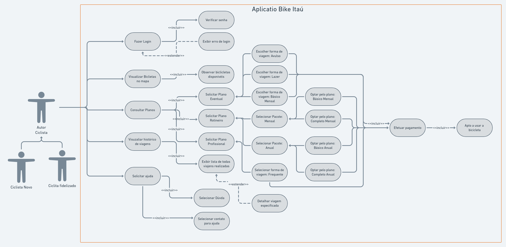
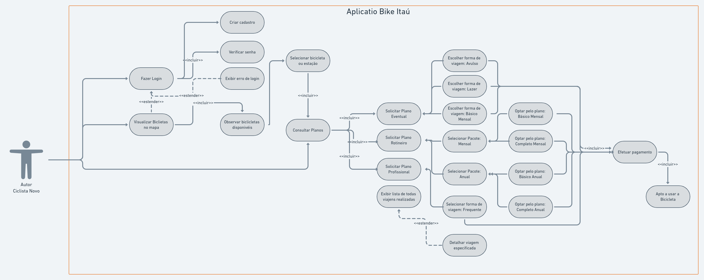
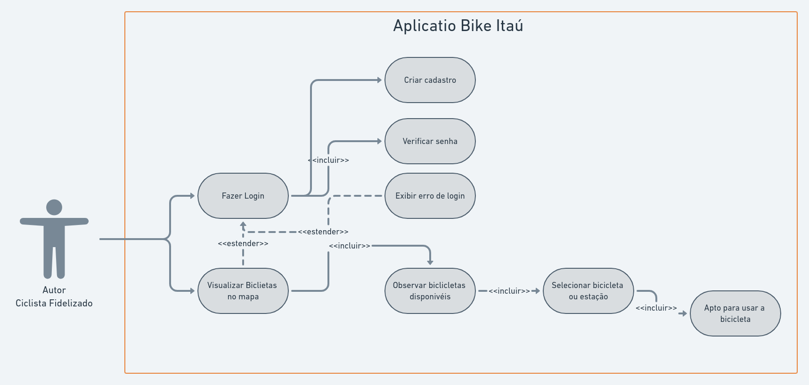

# Caso de uso

## Introdução

Caso de uso é a especificação dos requisitos, realizado na fase de especificação de requisitos em forma de documentos textuais. São redigidos pelos próprios desenvolvedores do sistema em parceria com os usuários. No caso de uso são identificados os autores e são anotadas as interações que realizam no sistema. Como os autores são diferentes pessoas (ou dispositivos) que interagem com o sistema, o autor representa um papel, e precisa ser específico e significativo, por isso é recomendável representar os autores com substantivos significativos para o contexto do sistema.

 

## Metodologia

 Como o Caso de uso representam as interações do autor com o sistema, a criação do Caso de Uso foi realizada utilizando dois autores (personas levantadas), descrevendo suas perspectivas ao interagirem com o sistema. Assim a persona Maria interagindo com o sistema pela primeira vez (usuário novo) e Yago que é um usuário fidelizado do aplicativo, utilizando diversas vezes e categorizado como um usuário que conhece o sistema. As interações foram levantadas e anotadas em uma tabela que representa o Caso de Uso e de uma forma mais visual as interações dos autores com o sistema foi criado o Diagrama de Caso de uso, utilizando a ferramenta disponível no site whimsical.

 

| US ID | Autor | Funcionalidade |
| :----: | :----: | :---------: |
| UC01 | Usuário | Realizar login no aplicativo |
| UC02 | Usuário | Fazer logout do perfil no aplicativo |
| UC03 | Usuário | Recuperar senha |
| UC04 | Usuário | Selecionar cidade (praça) |
| UC05 | Usuário | Escolher um plano (categoria de uso) |
| UC06 | Usuário | Verificar com mais detalhes informações sobre o plano de uso |
| UC07 | Usuário | Realizar pagamento |
| UC08 | Usuário | Observar em um mapa sua localização e todas as bicicletas disponíveis |
| UC09 | Usuário | Selecionar bicicleta desejada |
| UC10 | Usuário | Inserir código disponível no celular para liberar o uso da bicicleta |

## Fluxo de Caso de uso

#### Fluxo de uso - Login

|  | **Técnica de caso de uso para o Bike Itaú** |  |
| :--- | :--- | :--- |
| **Versão:** | 1.0   |  |
| **Atividade:** | Acessar o Bike Itaú   |  |
| **Ator:** | Usuário do Bike Itaú  |  |
| **Pré condição:** |  |  |
|  | 1. O usuário precisa estar com acesso a internet.|  |
| **Fluxo normal:** |  |  |
|  | 1. O usuário acessa o aplicativo e seleciona a opção de realizar login. |  |
|  |2. Insere email e senha de cadastro.  |  |
| **Fluxo Alternativo (extensões):** |  |  |
|  |  1a. O usuário pode acessar também pelo o site do bike Itaú. |  |
|  | 2a. Se o usuário não lembrar da senha, seleciona a opção de recuperação da senha. |  |

#### Fluxo de uso - Modelo Geral

|  | **Técnica de caso de uso para o Bike Itaú** |  |
| :--- | :--- | :--- |
| **Versão:** | 1.0   |  |
| **Atividade:** | Utilizar a bicicleta do Bike Itaú  |  |
| **Ator:** | Ciclista do Bike Itaú  |  |
| **Pré condição:** |  |  |
|  |  1. O usuário precisa possuir o aplicativo.|  |
|  | 2. O usuário precisa estar com acesso a internet. |  |
| **Fluxo normal:** |  |  |
|  | 1. O ciclista abre o aplicativo no seu dispositivo móvel. |  |
|  |2. Em um mapa, o ciclista consegue observar sua localização e das bicicletas.  |  |
|  |3. O ciclista seleciona a bicicleta que deseja utilizar.  |  |
|  |4. O ciclista deve escolher o plano que deseja usar.  |  |
|  |5. O ciclista informa os dados do cartão de crédito.  |  |
|  |6. O ciclista finaliza o pagamento e é gerado um código de desbloqueio da bicicleta.  |  |
|  |7. O ciclista digita o código na bicicleta e está liberado para usar.  |  |
| **Fluxo Alternativo (extensões):** |  |  |
|  |1a. Se o usuário não tiver cadastro, será necessário realizar o cadastro com email.  |  |
|  |1b. Caso o usuário tenha que realizar o login e não lembre a senha, pode solicitar a redefinição da senha.  |  |
|  |3a. O usuário pode escolher também a estação de bicicletas, com ou sem posto de autoatendimento.  |  |
|  |4a. Os Planos de uso podem ser adquiridos pelo aplicativo, site ou posto de  |  |

### Fluxo de uso - Escolha do Plano

|  | **Técnica de caso de uso para o Bike Itaú** |  |
| :--- | :--- | :--- |
| **Versão:** | 1.0   |  |
| **Atividade:** | Escolher plano de uso para utilizar as bicicletas do Bike Itaú  |  |
| **Ator:** | Usuário do Bike Itaú  |  |
| **Pré condição:** |  |  |
|  | 1. O usuário precisa estar com acesso a internet. |  |
| **Fluxo normal:** |  |  |
|  | 1. O ciclista abre o aplicativo no seu dispositivo móvel. |  |
|  | 2. No menu, selecione a opção Meus planos. |  |
|  | 3. O usuário seleciona a opção de Comprar plano. |  |
|  | 4. O usuário escolhe a cidade. |  |
|  | 5. O usuário seleciona o plano desejado entre as opções. |  |
|  | 6. O usuário opta pela categoria do do plano selecionado. |  |
|  | 7. O usuário finaliza o pagamento com cartão de crédito |  |
| **Fluxo Alternativo (extensões):** |  |  |
|  | 1a. O usuário pode acessar pelo site do bike Itaú. |  |
|  | 2a. Os Planos de uso podem ser adquiridos pelo aplicativo, site ou posto de autoatendimento. |  |
|  | 2b. Existe a alternativa de plano por cartão, onde o desbloqueio das bicicletas são feitos pelo cartão. |  |

### Fluxo de uso - Solicitar Ajuda

|  | **Técnica de caso de uso para o Bike Itaú** |  |
| :--- | :--- | :--- |
| **Versão:** | 1.0   |  |
| **Atividade:** | Solicitar ajuda do Bike Itaú  |  |
| **Ator:** | Usuário do Bike Itaú  |  |
| **Pré condição:** |  |  |
|  | 1. O usuário precisa estar com acesso a internet. |  |
| **Fluxo normal:** |  |  |
|  | 1. O usuário entra no aplicativo por meio de um dispositivo móvel. |  |
|  | 2. No menu, selecione a opção de Central de ajuda. |  |
|  | 3. O usuário seleciona a cidade. |  |
|  | 4. O usuário tem acesso às dúvidas mais frequentes, que possuem respostas pré estabelecidas. |  |
|  | 5. O usuário pode selecionar Entrar em contato Conosco, onde entra em uma conversa com um atendente do bike Itaú. |  |
| **Fluxo Alternativo (extensões):** |  |  |
|  |   1a. O usuário pode selecionar a dúvida por categoria, ou pela própria pergunta. |  |

## Diagrama de Caso de uso

Diagrama de caso de uso é o conjunto de casos em que os autores atuam no sistema. Portanto é um índice gráfico, elementos gráficos simples, de casos de uso (documentos textuais de especificação de requisitos). Um cenário que representa as funções que o autor irá realizar no sistema.
É apropriado usar diagrama de caso de uso, quando a metodologia de desenvolvimento é voltada para as práticas ágeis e com o foco no cliente, assim adotam a mentalidade de entrega rápida de valor ao cliente. Quando no processo de criação objetiva o usuário no centro dos processos, o autor naquele sistema. Vantajoso para representar requisitos funcionais na perspectiva do usuário do sistema.

 

#### Diagrama de Caso de Uso - Modelo Geral

<h6 align = "center">Figura 1 - Diagrama de Caso de Uso, Modelo Geral versão 1.0.</h6>

<h6 align = "center">Fonte: Site whimsical</h6>

#### Diagrama de Caso de Uso - Usuário Novo

<h6 align = "center">Figura 2 - Diagrama de Caso de Uso, Usuário Novo versão 1.0.</h6>

<h6 align = "center">Fonte: Site whimsical</h6>

#### Diagrama de Caso de Uso - Usuário Fidelizado

<h6 align = "center">Figura 3 - Diagrama de Caso de Uso, Usuário Fidelizado versão 1.0.</h6>

<h6 align = "center">Fonte: Site whimsical</h6>

## Referências

* [Whimsical: Think Together](https://whimsical.com/), acessado dia 11 de Março de 2021.

## Bibliografia

>VALENTE, Marco. **Engenharia de Software Moderna**. Princípios e práticas para desenvolvimento de software com produtividade. Belo Horizonte, 10 de fevereiro de 2020.

---

>SOMMERVILLE, Ian. **Engenharia de Software**. 9ª ed. PEARSON, 10 de fevereiro de 2011.

## Histórico de Revisões

| Data | Versão | Descrição | Autor(es) |
| :----: | :----: | :----: | :----: |
| 11/03/2021 | 1.0 | Criação do documento | [Tomás veloso](https://github.com/tomasvelos0) |