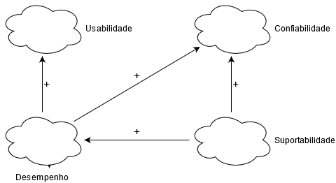
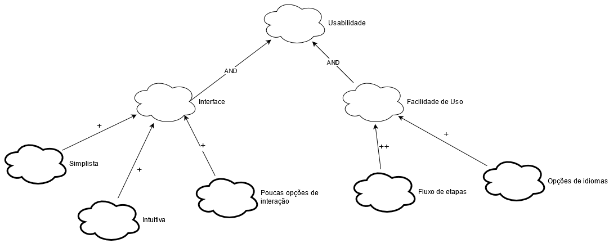
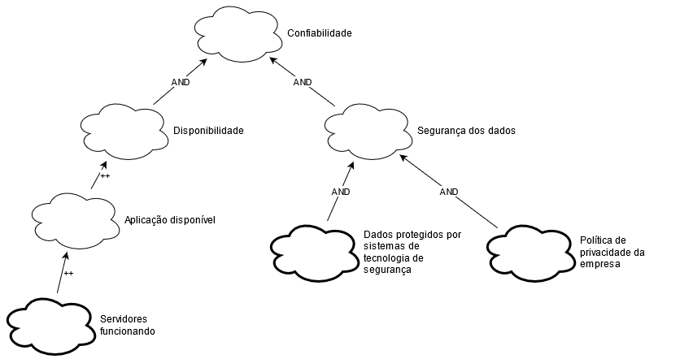
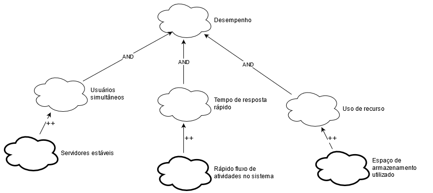
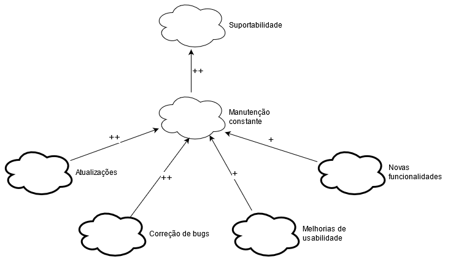

# NFR Framework

## Introdução

"O NFR Framework é uma abordagem para representar e analisar Requisitos Não-Funcionais. Seu objetivo é ajudar desenvolvedores na implementação de soluções personalizadas, levando em consideração as características do domínio e do sistema em questão. Tais características incluem Requisitos Não-funcionais, Requisitos funcionais, prioridades e carga detrabalho. Esses fatores determinam a escolha de alternativas de desenvolvimento para umdeterminado sistema (CHUNG et al., 2000).

O Framework utiliza o conceito de *softgoal*: um objetivo que não possui uma clara definição nem critérios de satisfação precisos. Os *softgoals* são utilizados para representar Requisitos Não-Funcionais e podem estar interrelacionados, expressando a influência de um *softgoal* em outro. O Framework também possui um método de análise qualitativa para decidir os status dos *softgoals*, dado que outros *softgoals* relacionados foram ou não satisfeitos (CHUNG et al., 2000)" (SILVA, 2019)

## Símbolos

### Tipos de softgoals

-   Softgoals NFR
-   Softgoals de Operacionalização

### Tipos de contribuições

- AND: contribuição AND
- ++: contribuição suficientemente positiva (MAKE)
- +: contribuição parcialmente positiva (HELP)

## NFR Geral

## NFR Usabilidade

## NFR Confiabilidade

## NFR Desempenho

## NFR Suportabilidade

## Referências
SILVA, Reinaldo Antônio da. NFR4ES: Um Catálogo de Requisitos Não-Funcionais para Sistemas Embarcados. Universidade Federal de Pernambuco, Recife, 2019.

## Histório de Revisões

| Data | Versão | Descrição | Autor(es) |
| --- | --- | --- | --- |
| 31/03/2021 | 1.0 | Criação do documento e gráficos NFR iniciais | [Matheus Clemente](https://www.github.com/matheusclemente/) |